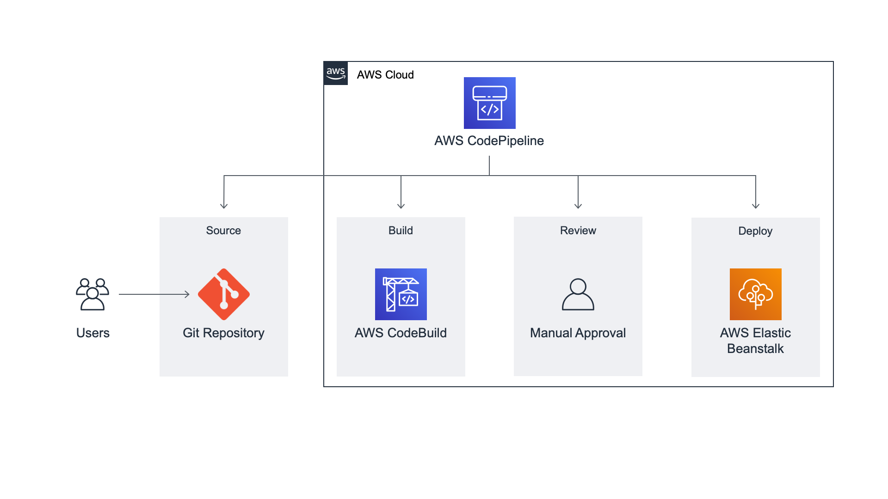
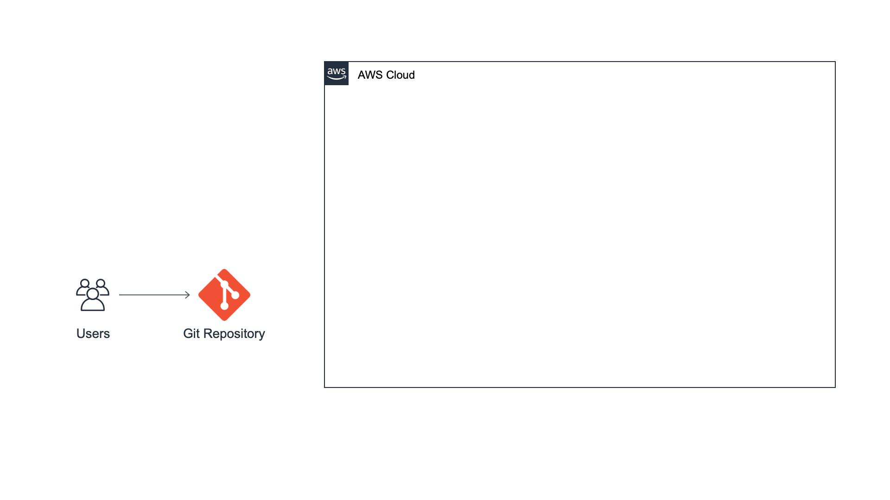
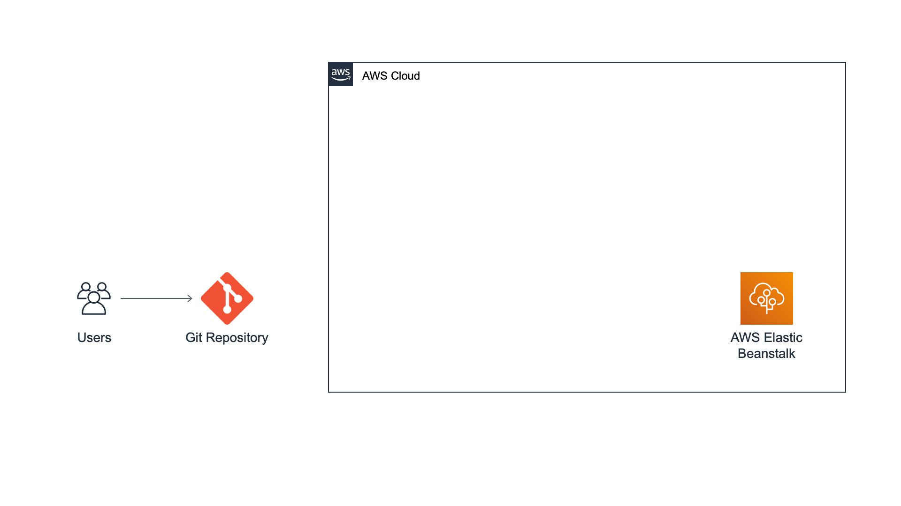
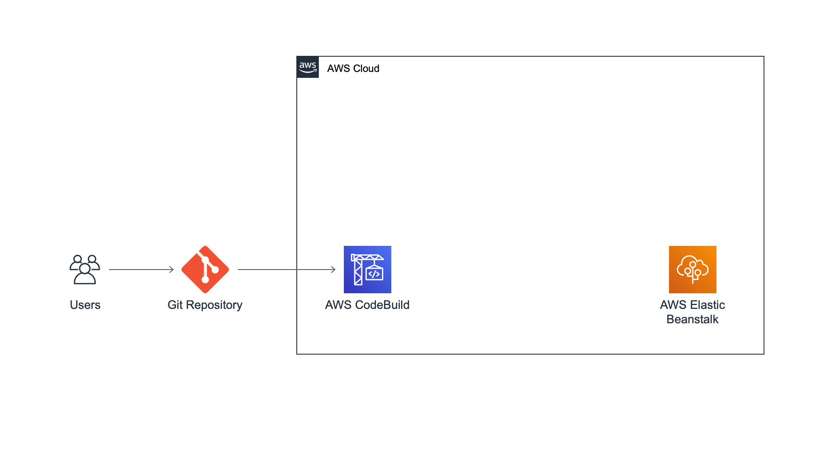
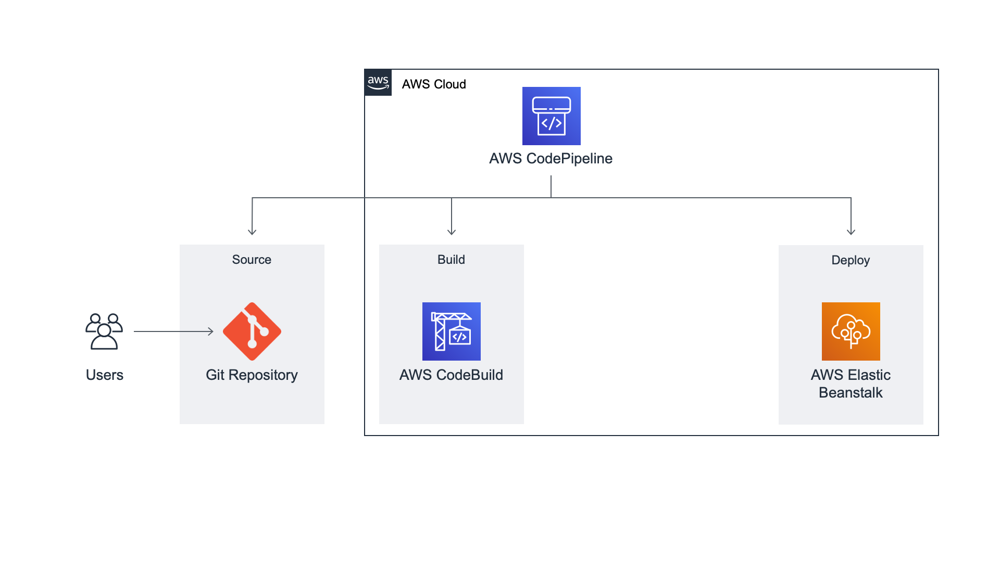

# Create Continuous Delivery Pipeline

- Set up a Git repo
- deploy a sample web app
- create a continuous delivery pipeline

##  Overview

In this tutorial, you will create a continuous delivery pipeline for a simple web application. You will first use a version control system to store your source code. Then, you will learn how to create a continuous delivery pipeline that will automatically deploy your web application whenever your source code is updated.

## What you will accomplish

This tutorial will walk you through the steps to create the continuous delivery pipeline discussed above. You will learn to:

- Set up a GitHub repository for the application code
- Create an AWS Elastic Beanstalk environment to deploy the application
- Configure AWS CodeBuild to build the source code from GitHub
- Use AWS CodePipeline to set up the continuous delivery pipeline with source, build, and deploy stages

## Application architecture

The following diagram provides a visual representation of the services used in this tutorial and how they are connected. This application uses GitHub, AWS Elastic Beanstalk, AWS CodeBuild, and AWS CodePipeline.




# Module 1: Set up Git Repo

1. Fork the following Repo [aws-elastic-beanstalk-express-js-sample](https://github.com/aws-samples/aws-elastic-beanstalk-express-js-sample)
2. Clone the repository.
3. Open the file app.js and change the message in line 5 to say something other than "Hello World!" and save the file.
4. push the local changes to the remote repo on Github.

```
git add app.js
git commit -m "change message"
git push 
```

###  Application architecture
We have created a code repository containing a simple web app. We will be using this repository to start our continuous delivery pipeline. It's important to set it up properly so we push code to it.



# Module 2: Deploy Web App 

Use the AWS Elastic Beanstalk console to create and deploy a web application. [AWS Elastic Beanstalk](https://aws.amazon.com/elasticbeanstalk/?e=gs2020&p=cicd-two) is a compute service that makes it easy to deploy and manage applications on AWS without having to worry about the infrastructure that runs them. You will use the Create web app wizard to create an application and launch an environment with the AWS resources needed to run your application. In subsequent modules, you will be using this environment and your continuous delivery pipeline to deploy the Hello World! web app created in Module 1.

##  What you will accomplish

- Configure and create an AWS Elastic Beanstalk environment
- Deploy a sample web app to AWS Elastic Beanstalk
- Test the sample web app 

## Key concepts

**AWS Elastic Beanstalk** - A service that makes it easy to deploy your application on AWS. You simply upload your code and Elastic Beanstalk deploys, manages, and scales your application.

**EC2 instance** - Virtual server in the cloud. Elastic Beanstalk will provision one or more Amazon EC2 instances when creating an environment.

**Web server** - Software that uses the HTTP protocol to serve content over the Internet. It is used to store, process, and deliver web pages.

**Platform** - Combination of operating system, programming language runtime, web server, application server, and Elastic Beanstalk components. Your application runs using the components provided by a platform.


## Implementation

### Configure an AWS Elastic Beanstalk app

1. Navigate to the service and **Create Application**.
2. Choose **Web server environment** under the Configure environment heading.
3. In the text box under the heading Application name, enter **DevOpsGettingStarted**.
4. In the Platform dropdown menu, under the Platform heading, select Node.js . Platform branch and Platform version will automatically populate with default selections.
5. On the Configure service access screen, choose Use an existing service role for Service Role.
6. If no role is found, complete the steps in [ Create IAM Role for EC2 instance profile](https://docs.aws.amazon.com/codedeploy/latest/userguide/getting-started-create-iam-instance-profile.html)
7. Choose **Skip to Review** and **Submit**.

### Test your web app

1. To test your sample web app, select the link under the name of your environment.
2. Once the test has completed, a new browser tab should open with a webpage congratulating you!

### Application architecture

We have created an **AWS Elastic Beanstalk** environment and sample application. We will be using this environment and our continuous delivery pipeline to deploy the Hello World! web app we created in the previous module.




# Module 3: Create Build Project

## Overview

Use **AWS CodeBuild** to build the source code previously stored in your GitHub repository. AWS CodeBuild is a fully managed continuous integration service that compiles source code, runs tests, and produces software packages that are ready to deploy.

## What you will accomplish

- Create a build project with AWS CodeBuild
- Set up GitHub as the source provider for a build project
- Run a build on AWS CodeBuild

##  Key concepts

**Build process**- Process that converts source code files into an executable software artifact. It may include the following steps: compiling source code, running tests, and packaging software for deployment.

- **Continuous integration** - Software development practice of regularly pushing changes to a hosted repository, after which automated builds and tests are run.

- **Build environment** - Represents a combination of the operating system, programming language runtime, and tools that CodeBuild uses to run a build.

- **Buildspec** - Collection of build commands and related settings, in YAML format, that CodeBuild uses to run a build.

- **Build Project** - Includes information about how to run a build, including where to get the source code, which build environment to use, which build commands to run, and where to store the build output.

- **OAuth** - Open protocol for secure authorization. OAuth enables you to connect your GitHub account to third-party applications, including AWS CodeBuild.

## Implementation

### Configure the AWS CodeBuild project

1. Open [AWS CodeBuild Console](https://console.aws.amazon.com/codesuite/codebuild/start?region=us-west-2) and choose **Create Project**.
2. In the Project name field, enter **Build-DevOpsGettingStarted**.
3. Select **GitHub** from the **Source provider** dropdown menu.
4. Confirm that the **Connect using OAuth** radio button is selected.
5. Choose the white **Connect to GitHub** button. A new browser tab will open asking you to give AWS CodeBuild access to your GitHub repo.
6. Select **Repository in my GitHub account**.
7. Enter **aws-elastic-beanstalk-express-js-sample** in the search field.
Confirm that Managed Image is selected.
8. Select Amazon Linux 2 from the Operating system dropdown menu.
9. Select **Standard** from the Runtime(s) dropdown menu.
10. Select **aws/codebuild/amazonlinux2-x86_64-standard:3.0** from the Image dropdown menu.
11. Confirm that **Always use the latest image for this runtime version** is selected for Image version.
12. Confirm that Linux is selected for Environment type.
13. Confirm that **New service role** is selected.

### Create a Buildspec file for the porject

1. Select **Insert build commands**.
2. Choose **Switch to editor**.
3. Replace the Buildspec in the editor with the code below and **Create build project.**

```
version: 0.2
phases:
    build:
        commands:
            - npm i --save
artifacts:
    files:
        - '**/*'
```

### Test the CodeBuild project

1. Choose the orange **Start build** button. This will load a page to configure the build process.
2. Confirm that the loaded page references the correct GitHub repo.
3. Choose the orange **Start build** button.
4. Wait for the build to complete. As you are waiting you should see a green bar at the top of the page with the message Build started, the progress for your build under Build log, and, after a couple minutes, a green checkmark and a Succeeded message confirming the build worked.

###  Application architecture

We have created a build project on AWS CodeBuild to run the build process of the Hello World! web app from our GitHub repository. We will be using this build project as the build step in our continuous delivery pipeline, which we will create in the next module.





# Module 4: Create Delivery Pipeline

## Overview

Use [AWS CodePipeline](https://aws.amazon.com/codepipeline/?e=gs2020&p=cicd-four) to set up a continuous delivery pipeline with source, build, and deploy stages. The pipeline will detect changes in the code stored in your GitHub repository, build the source code using AWS CodeBuild, and then deploy your application to AWS Elastic Beanstalk.

## What you will accomplish

- Set up a continuous delivery pipeline on AWS CodePipeline.
- Configure a source stage using your GitHub repo.
- Configure a build stage using AWS CodeBuild.
- Configure a deploy stage using your AWS ElasticBeanstalk application
- Deploy the application hosted on GitHub to Elastic Beanstalk through a pipeline

## Key Concepts

- **Continuous delivery** - Software development practice that allows developers to release software more quickly by automating the build, test, and deploy processes.
- **Pipeline** - Workflow model that describes how software changes go through the release process. Each pipeline is made up of a series of stages.
- **Stage** - Logical division of a pipeline, where actions are performed. A stage might be a build stage, where the source code is built and tests are run. It can also be a deployment stage, where code is deployed to runtime environments.
- **Action** - Set of tasks performed in a stage of the pipeline. For example, a source action can start a pipeline when source code is updated, and a deploy action can deploy code to a compute service like AWS Elastic Beanstalk.


## Implementation

### Create a new pipeline
1. Open [AWS CodePipeline console.](https://console.aws.amazon.com/codesuite/codepipeline/start?region=us-west-2), Choose Create Pipeline
2. In the Pipeline name field, enter ***Pipeline-DevOpsGettingStarted***.
3. Confirm that New service role is selected

### Configure the source stage
1. Select **GitHub version 1** from the **Source provider** dropdown menu.
2. Choose the white Connect to **GitHub** button. 
3. From the **Repository** dropdown, select the repo you created in Module 1.
4. Select **main** from the **branch** dropdown menu.
5. Confirm that **GitHub webhooks** is selected and choose **Next**.

## Configure the build stage
1. From the **Build provider** dropdown menu, select **AWS CodeBuild**.
2. Select **Build-DevOpsGettingStarted** under Project name.

## Configure the deploy stage
1. Select **AWS Elastic Beanstalk** from the **Deploy provider** dropdown menu.
2. Select the field under **Application name** and confirm you can see the app **DevOpsGettingStarted** created in Module 2.
3. Select **DevOpsGettingStarted-env** from the **Environment name** textbox.
4. Choose the **Next** button. You will now see a page where you can review the pipeline configuration and **Create Pipeline**.

##  Application architecture

We have created a continuous delivery pipeline on AWS CodePipeline with three stages: source, build, and deploy. The source code from the GitHub repo created in Module 1 is part of the source stage. That source code is then built by AWS CodeBuild in the build stage. Finally, the built code is deployed to the AWS Elastic Beanstalk environment created in Module 3.




# Module 5: Finalize Pipeline and Test
In this module, you will use AWS CodePipeline to add a review stage to your countinuous delivery pipeline.

As part of this process, you can add an approval action to a stage at the point where you want the pipeline execution to stop so someone can manually approve or reject the action. Manual approvals are useful to have someone else review a change before deployment. If the action is approved, the pipeline execution resumes. If the action is rejected—or if no one approves or rejects the action within seven days—the result is the same as the action failing, and the pipeline execution does not continue.

##  What you will accomplish
- Add a review stage to your pipeline
- Manually approve a change before it is deployed

##  Key concepts

- **Approval action** - Type of pipeline action that stops the pipeline execution until someone approves or rejects it.

**Pipeline execution** - Set of changes, such as a merged commit, released by a pipeline. Pipeline executions traverse the pipeline stages in order. Each pipeline stage can only process one execution at a time. To do this, a stage is locked while it processes an execution.

**Failed execution** - If an execution fails, it stops and does not completely traverse the pipeline. The pipeline status changes to Failed and the stage that was processing the execution is unlocked. A failed execution can be retried or replaced by a more recent execution.

## Implementation

### Create review stage in pipeline

1. Open the **AWS CodePipeline console**.
2. You should see the pipeline we created in Module 4, which was called **Pipeline-DevOpsGettingStarted**. Select this pipeline.
3. Choose the white **Edit** button near the top of the page.
4. Choose the white **Add** stage button between the **Build** and **Deploy** stages.
5. In the **Stage** name field, enter ***Review***.
6. Choose the orange **Add stage** button.
7. In the **Review** stage, choose the white **Add action group** button.
8. Under **Action** name, enter **Manual_Review**.
9. From the **Action provider** dropdown, select **Manual approval**.
10. Confirm that the optional fields have been left blank.
11. Choose the orange **Done** button.

### Push a new commit to your repo

```
git add app.js
git commit -m "Full pipeline test"
git push
```

##  Application architecture

